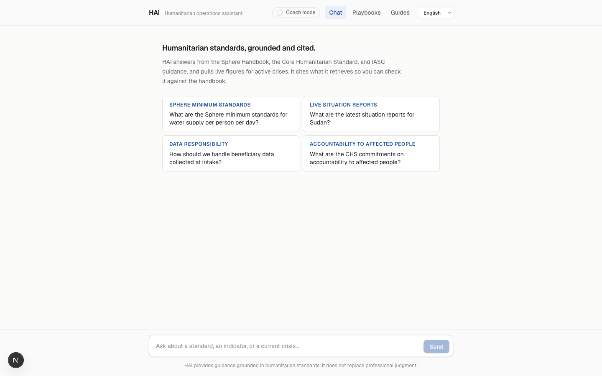
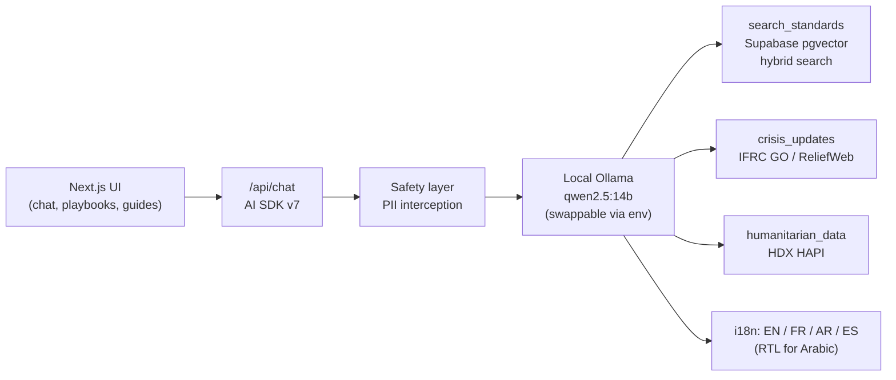
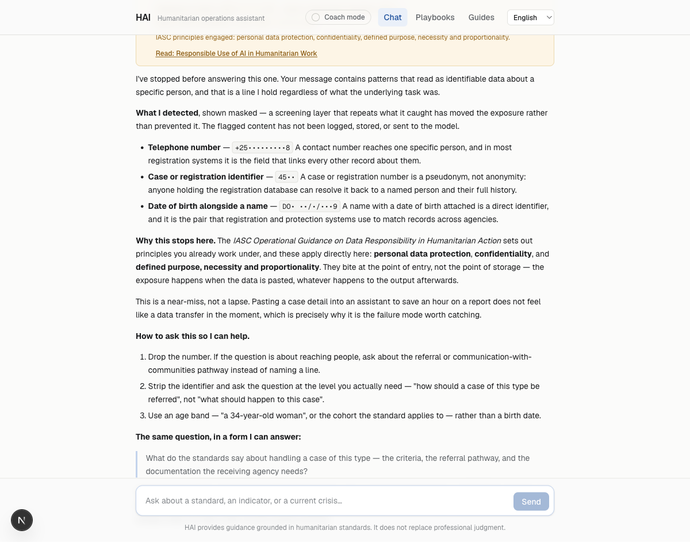
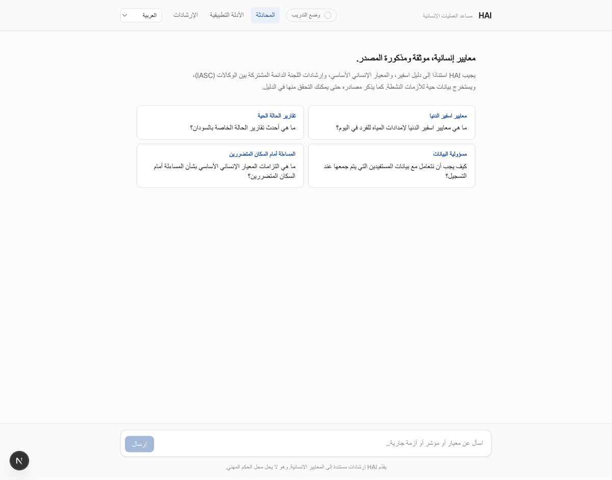

# HAI — Humanitarian AI Assistant

An agentic, citation-grounded AI assistant for humanitarian work. It answers
questions against primary references — the Sphere Handbook, the Core
Humanitarian Standard, and IASC guidance — and calls live tools for current
crisis data and structured humanitarian datasets, rather than relying on
facts memorized into model weights.

## What it is

- **Retrieval-grounded, not fine-tuned.** Answers cite the source passage
  they're grounded in. See [`research/README.md`](research/README.md) for
  why an earlier fine-tuning approach was abandoned.
- **Tool-using.** The assistant searches humanitarian standards, pulls
  current crisis updates, and queries structured humanitarian data — it
  doesn't just generate from a static prompt.
- **Runs entirely on a local model by default.** Chat and embeddings both go
  through local Ollama; no key and no per-token cost unless you deliberately
  point `LLM_BASE_URL` at a hosted endpoint.
- **Safety layer.** Every message is screened for personally identifiable
  data before it reaches the model, refused with the IASC principle it
  engages named explicitly, and offered a safe rephrasing — not a bare
  "I can't help with that." 114 tests cover it.
- **Evaluated by an independent judge.** A held-out set of 26 domain
  scenarios (`petri/seeds/humanitarian_test_scenarios.json`) is graded by a
  model from a different family than the one being tested, against explicit
  expected facts — not a self-graded, keyword-ratio heuristic. See
  [`evals/README.md`](evals/README.md).



## Architecture



- **UI**: Next.js app (`app/`) — chat, six role playbooks, three guides, and
  a coach mode that adds a short prompting lesson to each answer.
- **`/api/chat`**: AI SDK v7 route. The model is local `qwen2.5:14b` by
  default (`ollama create hai-qwen2.5 -f app/ollama/Modelfile` bakes in the
  16k context window HAI needs); `LLM_BASE_URL`/`LLM_MODEL`/`LLM_API_KEY`
  point it at any OpenAI-compatible endpoint instead, with no code change.
- **Safety layer**: deterministic regex/heuristic screening
  (`app/src/lib/safety/pii.ts`) runs on every message before it reaches the
  model — phone numbers, emails, case/registration identifiers, GPS
  coordinates, dates of birth, pasted rosters. An optional second-pass LLM
  screen (`PII_LLM_SCREEN=true`) catches bare names, off by default because
  it costs a full model round-trip per message.
- **Tools**:
  - `search_standards` — hybrid (vector + full-text, reciprocal rank fusion)
    search over 1,631 ingested chunks of humanitarian standards in a local
    Supabase pgvector instance.
  - `crisis_updates` — live situation reports. Prefers ReliefWeb, which
    since November 2025 requires an OCHA-approved `appname`; without one
    (the default) it falls back to **IFRC GO** (no registration required)
    and tells the model, and the user, which source answered.
  - `humanitarian_data` — structured country indicators from **HDX HAPI**
    (population, food security, funding, humanitarian needs). No key
    required.
- **i18n**: UI chrome in English, French, Arabic, Spanish, with RTL layout
  for Arabic. The model answers in whatever language the user writes in,
  independent of the UI locale.
- **Eval harness** (`evals/`): drives the 26-scenario suite against the live
  `/api/chat` route and grades transcripts with a judge model from a
  different family than the target — run outside the serving path, not on
  every request.

## Quickstart

Everything below runs locally with no paid API calls. Expect **10–15
minutes** if the models are already pulled, longer for the first `ollama
pull` (multi-GB) and the first corpus ingestion (embedding ~1,600 chunks
takes about 6 minutes once the corpus is fetched).

**Prerequisites**

- [Ollama](https://ollama.com), running (`ollama serve`)
- [Docker](https://docs.docker.com/get-docker/) (Supabase's local stack runs in it)
- [pnpm](https://pnpm.io) (`corepack enable` gets you `pnpm@10.13.1`, pinned in `app/package.json`)
- [Supabase CLI](https://supabase.com/docs/guides/local-development/cli/getting-started)

**1 — Pull the models and build the HAI variant**

```bash
ollama pull qwen2.5:14b
ollama pull mxbai-embed-large
ollama create hai-qwen2.5 -f app/ollama/Modelfile   # bakes in the 16k context HAI needs
```

**2 — Fetch the corpus** (Sphere Handbook, CHS, three IASC guidance docs — not committed; see licensing note in `ingestion/README.md`)

```bash
cd ingestion
./fetch-corpus.sh          # downloads and verifies sha256 against known-good copies
```

**3 — Start Supabase and apply migrations**

```bash
cd ..                      # repo root
supabase start              # applies supabase/migrations/ automatically; prints keys
```

Note the `API_URL` (`http://127.0.0.1:54421`) and `SERVICE_ROLE_KEY`/`ANON_KEY`
it prints — the default ports are shifted +100 from Supabase's usual range
because another local project already holds `5432x` on this machine.

**4 — Ingest the corpus**

```bash
cd ingestion
pnpm install
cp .env.example .env        # fill in SUPABASE_SERVICE_ROLE_KEY from step 3
pnpm ingest                 # extract -> chunk -> contextualize -> embed -> load
pnpm search "minimum water supply per person per day"   # sanity check
```

**5 — Configure and run the app**

```bash
cd ../app
pnpm install
cp .env.example .env.local  # fill in SUPABASE_ANON_KEY from step 3
pnpm dev
```

Open `http://localhost:3000`. `RELIEFWEB_APPNAME` and `HDX_APP_IDENTIFIER`
are optional — both tools work without them (see Architecture above).

Full detail on each ingestion stage, the RPC contract, and known gaps (the
corpus currently loads without contextual-retrieval preambles — retrieval
works, the ranking boost doesn't yet) is in
[`ingestion/README.md`](ingestion/README.md).

|  |  |
|---|---|
| Safety layer: a case-detail paste caught before it reaches the model, with the IASC principle named | Arabic locale — full RTL layout, not just translated labels |

## Docs

| Doc | What's in it |
|---|---|
| [`docs/STRATEGY.md`](docs/STRATEGY.md) | Why this architecture — the case for grounding over fine-tuning |
| [`docs/ENABLEMENT.md`](docs/ENABLEMENT.md) | How an organization adopts AI well; the framework the playbooks/guides implement |
| [`docs/DEMO.md`](docs/DEMO.md) | 5-minute demo script, beat by beat |
| [`research/README.md`](research/README.md) | Honest postmortem: the original fine-tune + audit prototype, and the three bugs that invalidated its results |
| [`content/playbooks/`](content/playbooks/) | Six role-specific playbooks (program, protection, MEAL, comms, grants, logistics) |
| [`content/guides/`](content/guides/) | Effective prompting, responsible use, starting a community of practice |
| [`evals/README.md`](evals/README.md) | How the eval harness works and why the judge is trustworthy |

## Repo layout

| Path | Contents |
|---|---|
| `app/` | Next.js application (UI + `/api/chat` route, safety layer, i18n) |
| `ingestion/` | Corpus → chunking → embeddings → Supabase pgvector pipeline |
| `evals/` | Eval harness driving `petri/seeds/` scenarios against the live app |
| `petri/seeds/` | The 26-scenario eval suite (kept as-is from the prototype) |
| `content/` | Playbooks and guides shown in the app and used by the eval scenarios |
| `research/` | Archived fine-tune/audit prototype + honest postmortem — **start here** for context on why the project pivoted: [`research/README.md`](research/README.md) |

## Prior work

The original prototype attempted a LoRA fine-tune of a local model,
validated by a Petri-style auditor. Three bugs invalidated its results (a
self-judging auditor, a training-data extractor that scraped source code
instead of prose, and a passing threshold that let empty answers through).
Full writeup, with file:line references: [`research/README.md`](research/README.md).
