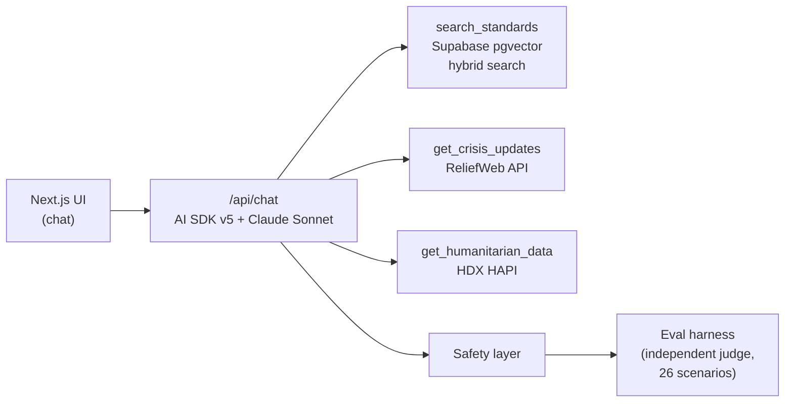

# HAI — Humanitarian AI Assistant

An agentic, citation-grounded AI assistant for humanitarian work. It answers
questions against primary references — the Sphere Handbook, the Core
Humanitarian Standard, and IASC guidance — and calls live tools for current
crisis data (ReliefWeb) and structured humanitarian datasets (HDX HAPI),
rather than relying on facts memorized into model weights.

## What it is

- **Retrieval-grounded, not fine-tuned.** Answers cite the source passage
  they're grounded in. See [`research/README.md`](research/README.md) for
  why an earlier fine-tuning approach was abandoned.
- **Tool-using.** The assistant can search humanitarian standards, pull
  current crisis updates, and query structured humanitarian data — it
  doesn't just generate from a static prompt.
- **Evaluated by an independent judge.** A held-out set of 26 domain
  scenarios is graded by a model from a different family than the one being
  tested, against explicit expected facts — not a self-graded, keyword-ratio
  heuristic. See [Evals](#evals).

## Architecture

- **UI**: Next.js app (`app/`) using the Vercel AI SDK's chat components.
- **`/api/chat`**: AI SDK v5 route calling Claude (Sonnet) with tool
  definitions.
- **Tools**:
  - `search_standards` — hybrid (vector + keyword) search over an ingested
    corpus of humanitarian standards in Supabase pgvector.
  - `get_crisis_updates` — live data from the ReliefWeb API.
  - `get_humanitarian_data` — structured indicators from HDX HAPI.
- **Safety layer + eval harness**: independent-judge scoring against the
  scenario suite described below, run outside the serving path.

## Status

In active development. Nothing below is a finished product claim:

- [x] Repo restructured; prior fine-tune/audit prototype archived and
      documented (see `research/`)
- [ ] Next.js app scaffold (`app/`)
- [ ] Corpus ingestion pipeline (`ingestion/`)
- [ ] `search_standards`, `get_crisis_updates`, `get_humanitarian_data` tools
- [ ] Eval harness wired to an independent judge model (`evals/`)

## Eval suite

`petri/seeds/humanitarian_test_scenarios.json` holds 26 domain-literate
scenarios (crisis classification, protection principles, disinformation
resistance, etc.), each with `evaluation_criteria` and expected facts to
check for. This scenario design survived the pivot unchanged — what's
changing is how it's judged (see [`evals/README.md`](evals/README.md)).

## Repo layout

| Path | Contents |
|---|---|
| `app/` | Next.js application (UI + `/api/chat` route) |
| `ingestion/` | Corpus → chunking → embeddings → Supabase pgvector pipeline |
| `evals/` | Eval harness driving `petri/seeds/` scenarios |
| `petri/seeds/` | The 26-scenario eval suite (kept as-is from the prototype) |
| `petri/results/` | Historical audit output — see the warning in `research/docs/` before citing it |
| `data/` | Processed reference data |
| `research/` | Archived fine-tune/audit prototype + honest postmortem — **start here** for context on why the project pivoted: [`research/README.md`](research/README.md) |

## Prior work

The original prototype attempted a LoRA fine-tune of a local model,
validated by a Petri-style auditor. Three bugs invalidated its results (a
self-judging auditor, a training-data extractor that scraped source code
instead of prose, and a passing threshold that let empty answers through).
Full writeup, with file:line references: [`research/README.md`](research/README.md).
