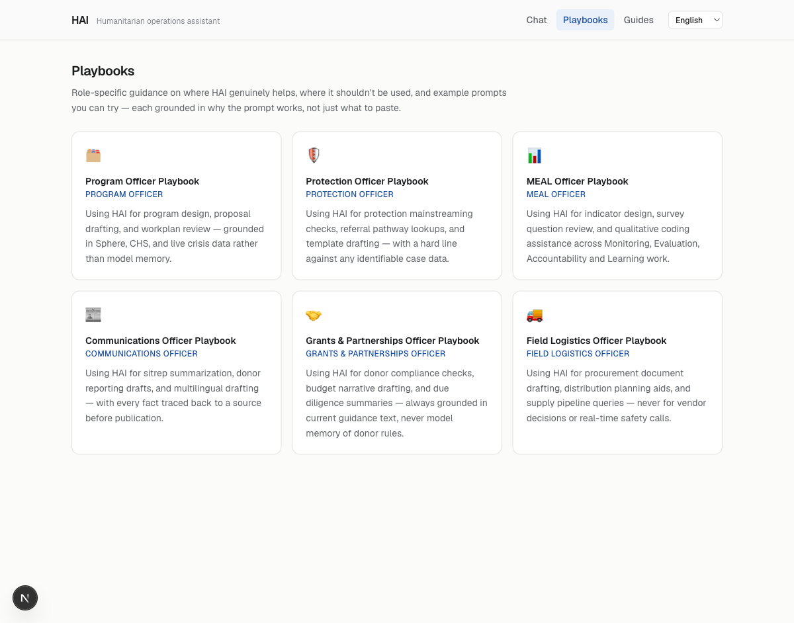

# HAI — 5-minute demo script

Run `pnpm dev` in `app/` (Ollama and Supabase already running — see the
[Quickstart](../README.md#quickstart)) and open `http://localhost:3000`.
Seven beats, each with the exact click/query and why it matters.

## 1 — Grounded standards query → citations panel

Click the **"Sphere minimum standards"** suggestion on the empty state (or
type: *"What are the Sphere minimum standards for water supply per person
per day?"*).

Point out: the answer states **15 litres per person per day** and cites
**Water supply standard 2.1**. Click the citation to open the source panel —
it shows the retrieved passage, section path, and page number from the
ingested Sphere Handbook, not a paraphrase from model memory.

**Why it matters:** this is the whole thesis of the project. An earlier,
ungrounded version of this exact assistant invented both the figure and the
citation when asked this question with an empty knowledge base (documented
in `docs/STRATEGY.md`). The citation panel is the difference between a
plausible-sounding answer and a checkable one.

## 2 — Live-data query → HDX/IFRC figures, source labeling

Click **"Live situation reports"** (*"What are the latest situation reports
for Sudan?"*).

Point out: the assistant names which live source answered — **IFRC GO** by
default, since ReliefWeb's `RELIEFWEB_APPNAME` requires OCHA pre-approval
and this deployment doesn't have one yet — and says so explicitly rather
than silently substituting a narrower source. If the question calls for
structured indicators (population, food security, funding), the
`humanitarian_data` tool pulls from **HDX HAPI** instead.

**Why it matters:** humanitarian data is time-sensitive and multi-sourced.
An assistant that cites *which* feed answered, and flags when it's the
narrower fallback, lets a practitioner judge how much to trust the number —
something a model answering from stale training data cannot do at all.


## 3 — The PII teaching moment

Paste this into the composer:

```
Amina Hassan, case #4512, DOB 12/3/1989, phone +254712345678
```

Point out: an amber banner intercepts the message before it reaches the
model. It names the patterns it caught (case/registration identifier, date
of birth, phone number), names the IASC principle engaged (Data
Responsibility in Humanitarian Action), and links to the in-app
**Responsible use** guide — then offers the same underlying question asked
in a safe, de-identified form.

**Why it matters:** the fastest way to misuse AI in this sector is pasting a
real case record into a chat box "to summarize." The screening is
deterministic (regex/heuristics, no model call, nothing logged or echoed)
and runs on every message before generation — and the refusal teaches the
principle instead of just blocking, so the user doesn't route around it by
trying a different phrasing.

## 4 — Coach mode on a vague prompt

Toggle **Coach** on (button next to the composer), then send something
under-specified, e.g. *"tell me about the situation."*

Point out: the answer opens with a short coaching note — one concrete
strength, one concrete and specific improvement (not "be more specific"),
and the improved prompt shown — then answers the improved version.

**Why it matters:** this is the enablement thesis from `docs/ENABLEMENT.md`
in miniature — meeting people where their prompting skill already is,
inside the tool they're using, rather than a separate training session.



## 5 — Playbooks → try in chat

Navigate to **Playbooks**, open any role (e.g. Protection Officer). Point
out the skill-tagged example prompts (beginner/intermediate/advanced) and
the role-specific "where AI should NOT be used" section. Click **Try in
chat** on one example — it prefills the composer but does not auto-send.

**Why it matters:** the prefill-without-autosend is deliberate — it teaches
by having the person complete the action themselves, not by acting on their
behalf. Six playbooks (program, protection, MEAL, comms, grants, field
logistics) exist because a protection officer and a grants officer need
different examples and different cautions, not a generic one-pager.

## 6 — Switch to French → grounded answer in French

Use the locale switcher in the header to select **Français**. Click the
now-French **"Normes minimales Sphère"** suggestion (*"Quelles sont les
normes minimales Sphère pour l'approvisionnement en eau par personne et par
jour ?"*).

Point out: the UI chrome and the suggested query are French, and the
model's answer comes back in French, grounded in the same English-language
Sphere corpus — the model translates the grounded facts, it doesn't need a
separately-ingested French corpus. Arabic additionally flips the whole
layout to RTL, not just the label strings — switch to **العربية** to show it:


**Why it matters:** humanitarian staff work across languages daily; a tool
that only serves English-speaking staff excludes most of the workforce it
claims to help.

## 7 — Close on the postmortem and eval philosophy

Open [`research/README.md`](../research/README.md). Point out: the original
prototype's audit reported **26/26 scenarios passed, 100%, "READY TO
TRAIN"** — and that number was invalid, because three independent bugs (a
self-judging auditor, a training-data extractor that scraped source code
instead of prose, and a passing threshold that let empty answers through)
each biased the result toward "looks fine."

Then point to [`evals/README.md`](../evals/README.md): the rebuilt harness
grades the live `/api/chat` route with a judge model from a **different
model family** than the target, nothing defaults to a pass (every verdict
enum has an explicit `judge_error` state), and the judge never sees an
answer key — only the transcript and one criterion phrased as a question
about it.

**Why it matters:** this is the credibility close. Any team can claim their
assistant is safe and accurate; the point of this section is showing the
receipts for why the current evaluation method can be trusted where the
previous one couldn't — including admitting the previous one was wrong.
