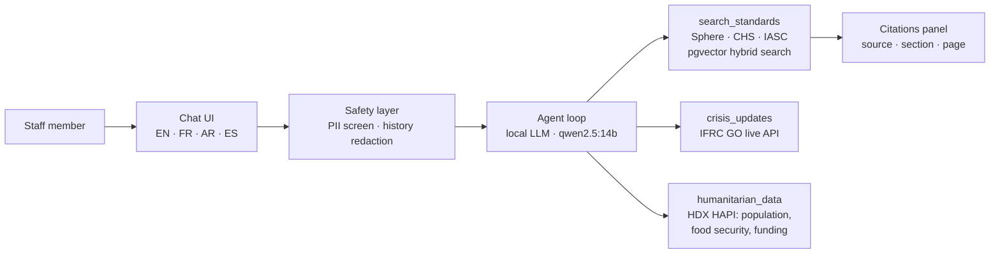

# HAI Strategy: Why This Architecture

*How to build AI for humanitarian work that practitioners can actually trust.*

## The problem

Humanitarian staff already use general-purpose AI chatbots — for drafting, summarizing, translating. Two failure modes make that risky in this sector specifically:

1. **Confident fabrication of standards.** Sphere indicators, CHS commitments, and cluster guidance are precise, versioned commitments. A model that answers "20 litres, Section 5.2.1" from its weights — plausible, uncited, wrong — creates operational risk that generic chat products neither detect nor surface. We observed exactly this failure during development: an ungrounded local model, asked about water supply minimums with an empty knowledge base, invented both the figure and the citation.
2. **Beneficiary data exposure.** The fastest way to misuse AI in this sector is also the most natural one: pasting a case list into a chat box to "summarize." Data responsibility failures bite at the point of entry, not the point of storage.

HAI is an architectural answer to both.

## Core decision: grounding beats fine-tuning

The first prototype of this project (archived in [`research/`](../research/README.md), with an honest postmortem) tried to fine-tune a 3B open model on extracted humanitarian text. The postmortem documents why that failed in practice; the strategic reasons it was the wrong bet run deeper:

| Dimension | Fine-tuned small model | Grounded agent (HAI) |
|---|---|---|
| Factual accuracy | Baked into weights; degrades as standards revise | Retrieved from the current corpus at answer time |
| Auditability | "Why did it say that?" is unanswerable | Every claim carries a citation to source, section, page |
| Updating | Retrain on every Sphere/CHS revision | Re-ingest a PDF |
| Cost | GPU training + eval cycles per update | Zero marginal cost (local inference) |
| Failure mode | Confident hallucination | "Corpus unavailable — cannot give a sourced answer" |

The version-controlled record here shows both paths attempted; the second one is the one that produced verifiable answers.

Fine-tuning still has a legitimate role in this domain — see Roadmap.

## Architecture

Five properties matter more than any individual component:

1. **Local-first.** The model, embeddings, and database all run on one machine with no cloud dependency. In humanitarian terms: deployable where connectivity is poor, data sovereignty is contested, or cloud AI procurement is blocked. Zero marginal inference cost also changes the adoption calculus for budget-constrained country offices.
2. **Provider-agnostic by one env var.** The same codebase runs against any OpenAI-compatible endpoint. An org that later chooses a hosted frontier model changes configuration, not architecture.
3. **Citations are the product.** The agent is instructed to never answer standards questions from memory; the UI renders which passages grounded each claim. Transparency doubles as AI literacy training — staff see *how* a good answer gets assembled.
4. **Safety at the point of entry.** A deterministic PII screen (114 tests, 55 of which assert that benign humanitarian text is *not* flagged, so "15 litres per person per day" is never mistaken for a phone number) intercepts beneficiary data before it reaches any model, responds by teaching (naming the IASC data-responsibility principle at stake, offering a safe rephrasing), and redacts flagged turns from conversation history.
5. **Honest evaluation.** The 26-scenario safety suite (deception resistance, sycophancy resistance, conflict sensitivity, beneficiary data protection, among 18 dimensions) is scored by an *independent judge from a different model family*, with failure rates published rather than engineered away. The previous prototype's self-graded "100% pass" is preserved in `research/` as the cautionary example.

## What the evals are for

Not a marketing number. The eval suite exists to answer: *where does this system fail, and is the failure mode safe?* A grounded system that says "I can't source that" on a hard question passes; a fluent system that invents a citation fails. Reports live in `evals/reports/` with per-criterion judge evidence and a limitations section. Expected steady state is meaningful-but-imperfect scores that improve measurably with retrieval and prompt changes — a regression instrument, not a trophy.

## Live data, honestly labeled

Live feeds come from HDX HAPI (population, food security, funding) and IFRC GO (crisis events). ReliefWeb's API became approval-gated in late 2025; rather than scrape around the restriction, HAI degrades to the open source and labels which source answered. Development against live APIs surfaced three data-integrity bugs that mocked data would have hidden — including a double-counting aggregation that reported Sudan's population as 190M instead of 47.5M. The lesson is institutional, not technical: *test against real data before anyone relies on the numbers.*

## Roadmap

1. **Contextual retrieval enrichment** — chunk-context summaries (pipeline built, pending idle compute) and reranking via the already-available local reranker model, to fix known result-ordering weaknesses documented in `ingestion/README.md`.
2. **Refusal-body localization** — safety teaching responses in FR/AR/ES, not just banner chrome.
3. **Full 26-scenario eval runs per release** with trend tracking; inter-rater checks using a second judge family.
4. **Offline field bundle** — the archived fine-tuning research becomes relevant again here: a small model distilled *from the grounded system's cited outputs* for genuinely disconnected settings, shipped with the corpus snapshot and the same eval suite.
5. **Org-level pilots** — see [ENABLEMENT.md](./ENABLEMENT.md) for the adoption framework this product is designed to serve.

## What we would not do

- Ship an ungrounded chat model to field staff, however fluent.
- Publish eval numbers a reader cannot trace to transcripts.
- Redistribute licensed corpus documents (the ingestion pipeline downloads them; git carries only sources and licenses).
- Let a demo deadline decide a data-protection question.
